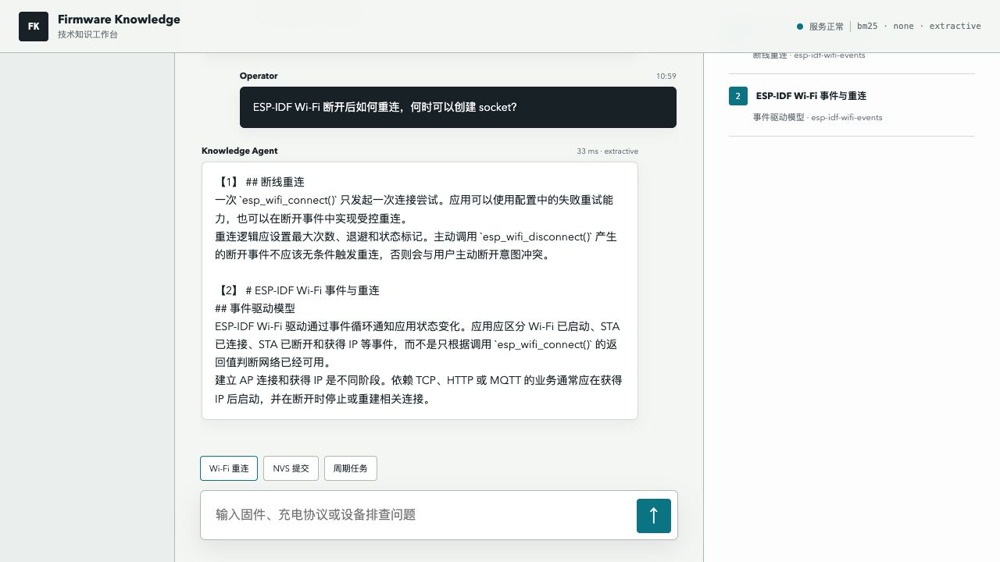
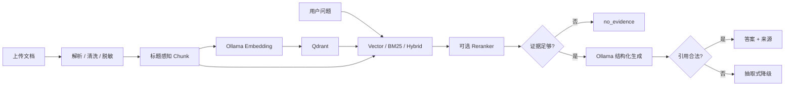

# Firmware Knowledge Agent

面向嵌入式固件与智能充电业务文档的 Agentic RAG。系统完成文档解析、清洗、
切分、Embedding、Qdrant 检索、可选混合检索和重排，并通过 LangGraph 实现证据
门控、生成、引用校验、拒答与抽取式降级。

当前冻结版本：`1.0.1`。

## 当前能力

| 层次 | 实现 |
| --- | --- |
| 文档入库 | Markdown、TXT、HTML、PDF、DOCX 上传和本地导入 |
| 预处理 | 文本清洗、敏感内容脱敏、表格保留、标题感知 Chunk |
| Embedding | 本地 Ollama `qwen3-embedding:0.6b`，带内容缓存 |
| 向量库 | Qdrant 本地持久化，语料/模型/切分指纹变化自动重建 |
| 检索 | BM25、Vector、Hybrid RRF，可选 ONNX CrossEncoder Reranker |
| 回答 | Ollama `llama3.1:8b` 结构化生成；引用不合法或模型失败时抽取式降级 |
| 拒答 | 相似度证据门槛，无足够证据时不调用生成模型 |
| 接口 | FastAPI、Swagger、Web 知识工作台、CLI |
| 评测 | 检索、拒答、答案关键词、来源命中、引用合法性、降级率和延迟 |
| 部署 | Docker；已通过 DeviceOps Compose 在 macOS OrbStack 验证 |
| 测试 | `50 passed` |

## 演示截图



截图使用仓库内 3 篇公开样例语料和抽取式生成；示例问题会根据当前语料切换，
不会在公开 Mock 环境展示只能由私有业务语料回答的固定问题。

## 数据链路



## 冻结语料

当前本机私有快照：

- 53 篇脱敏业务与技术文档。
- 501 个 Chunk。
- `chunk_size=1000`，`chunk_overlap=150`。
- Vector Retriever，`top_k=4`。
- 余弦相似度门槛 `0.55`。
- Ollama Embedding：`qwen3-embedding:0.6b`。

文档覆盖设备连接、Wi-Fi、MQTT、任务调度、端口协议、功率分配、固件升级、
充电兼容性、效率、温度策略、PD 抓取和设备测试方法。语料数量不是目标；选择
这些内容是为了让检索覆盖真实演示中的连接、协议、功率和故障诊断问题。

私有语料、评测题、逐题结果和向量索引都位于 Git 忽略的
`var/private-corpus/`，不会随项目分发。公开仓库仅保留不含文档 ID、问题正文和
来源 URL 的 [`聚合评测报告`](evals/reports/private_corpus_summary.json)。

## 冻结评测

参数冻结后建立 40 题留出集：

- 30 条可回答问题。
- 10 条业务相邻但语料没有答案的问题。
- 每条可回答题预先标注期望来源和证据词组。

### 检索评测

| 指标 | 结果 |
| --- | ---: |
| Hit@3 | 0.9667 |
| MRR | 0.8556 |
| 域外拒答准确率 | 1.0000 |
| 总体准确率 | 0.9750 |

### 端到端答案基线

抽取式生成用于稳定回归，不受生成模型随机性影响：

| 指标 | 结果 |
| --- | ---: |
| 端到端通过率 | 0.9250 |
| 来源命中率 | 1.0000 |
| 答案证据词准确率 | 0.9000 |
| 引用合法率 | 1.0000 |
| 域外拒答准确率 | 1.0000 |
| 降级率 | 0.0000 |
| 平均延迟 | 113.82 ms |
| P95 延迟 | 180.96 ms |

### Ollama 生成评测

同一冻结留出集使用 `llama3.1:8b` 完整生成：

| 指标 | 结果 |
| --- | ---: |
| 来源命中率 | 1.0000 |
| 引用合法率 | 1.0000 |
| 域外拒答准确率 | 1.0000 |
| 严格证据词覆盖率 | 0.1667 |
| 严格端到端通过率 | 0.3750 |
| 平均延迟 | 10.87 s |
| P95 延迟 | 20.66 s |

结果说明检索与引用边界稳定，但 8B 本地模型经常用概括或改写回答，没有保留
人工标注的关键术语。项目不使用这份留出集反向调整 Prompt；该报告作为生成质量
和本地推理延迟的真实基线保留。简历只使用可复现的检索指标与抽取式答案基线，
不把该结果包装成高质量生成准确率。

这些指标不能表述为“任意问题准确率”。自动评测检查来源、证据词和引用格式，
不等价于人工事实一致性审阅。详细口径见 [`evals/README.md`](evals/README.md)。

## 快速运行

要求 Python 3.13 和 Ollama：

```bash
ollama pull qwen3-embedding:0.6b
ollama pull llama3.1:8b
UV_CACHE_DIR=.uv-cache uv sync --extra dev
```

完整的双项目离线演示由同级 `device-agent-lab` 提供：

```bash
../device-agent-lab/scripts/run_mock_stack.py
```

该命令固定使用本仓库的公开样例语料、BM25 和抽取式生成，不需要 Ollama、API
Key 或私有语料；同时启动 DeviceOps Mock 设备并完成两边健康检查。

无需占用端口的跨项目闭环评测：

```bash
../device-agent-lab/.venv/bin/python \
  ../device-agent-lab/scripts/evaluate_mock_stack.py
```

它使用本仓库自己的虚拟环境处理真实 FastAPI 请求，再由 DeviceOps 的
`HttpKnowledgeGateway` 消费结果。公开基线为 `8/8`；完整用例、逐条 Trace、
引用来源和证据边界保存在兄弟项目的
`evals/reports/mock_stack_e2e.json`。

复制 `.env.example` 为 `.env` 后，将 catalog、缓存和向量库指向自己的本地目录。
当前私有演示配置不提交 Git。

启动：

```bash
.venv/bin/uvicorn firmware_knowledge_agent.api:app \
  --host 127.0.0.1 --port 8011
```

入口：

- 知识工作台：`http://127.0.0.1:8011/`
- Swagger：`http://127.0.0.1:8011/docs`
- 健康检查：`http://127.0.0.1:8011/health`

## API

检索：

```bash
curl -X POST http://127.0.0.1:8011/v1/search \
  -H 'Content-Type: application/json' \
  -d '{"query":"设备端口充电异常应该检查哪些证据？","top_k":4}'
```

完整 Agentic RAG：

```bash
curl -X POST http://127.0.0.1:8011/v1/agent/answer \
  -H 'Content-Type: application/json' \
  -d '{"query":"PD请求能力与实际协商不一致时如何排查？","top_k":4}'
```

上传：

```bash
curl -X POST http://127.0.0.1:8011/v1/corpus/upload \
  -F 'file=@/absolute/path/to/document.pdf' \
  -F 'title=设备故障排查说明'
```

## 评测命令

检索留出集：

```bash
.venv/bin/python -m firmware_knowledge_agent.evaluation \
  --catalog var/private-corpus/sources.json \
  --questions var/private-corpus/holdout-v2.json \
  --retriever vector \
  --embedding-cache var/private-corpus/embeddings-v2.json \
  --chunk-size 1000 \
  --chunk-overlap 150 \
  --vector-min-score 0.55 \
  --vector-store var/private-corpus/vector-store-v2 \
  --vector-collection firmware_private_v2 \
  --strict-label-audit \
  --output var/private-corpus/holdout-v2-vector.json
```

端到端回答：

```bash
FIRMWARE_RAG_GENERATOR=ollama \
  .venv/bin/python -m firmware_knowledge_agent.answer_evaluation \
  --catalog var/private-corpus/sources.json \
  --questions var/private-corpus/holdout-v2.json \
  --top-k 4 \
  --output var/private-corpus/answer-eval-ollama.json
```

## Docker

独立镜像由本项目 `Dockerfile` 构建。完整双项目编排位于：

```text
../device-agent-lab/deploy/compose.yaml
```

容器通过 `host.docker.internal` 调用宿主 Ollama。嵌入式 Qdrant 只支持当前
单进程演示；多副本部署需要独立 Qdrant Server。

## 测试

```bash
.venv/bin/pytest -q
.venv/bin/python -m compileall -q src tests
node --check src/firmware_knowledge_agent/web/app.js
```

## 目录

```text
src/firmware_knowledge_agent/
  corpus.py             # 来源目录、读取与切分
  local_ingestion.py    # 本地文件解析、清洗、脱敏、增量导入
  public_ingestion.py   # 网页采集与表格保留
  embeddings.py         # Gemini / Ollama Embedding 与缓存
  retrieval.py          # BM25、Vector、Hybrid 和查询规范化
  reranking.py          # 可选 CrossEncoder
  vector_store.py       # Qdrant 与索引指纹
  service.py            # 搜索、引用、证据门槛
  agentic_workflow.py   # LangGraph 生成、拒答、引用校验和降级
  evaluation.py         # 检索评测
  answer_evaluation.py  # 端到端答案评测
  api.py                # FastAPI
  web/                  # 知识工作台
data/sample/            # 可公开的最小测试语料
evals/                  # 可公开评测说明与报告
var/private-corpus/     # 本机私有语料、索引和报告，不提交
```

## 项目边界

- 当前私有 Wiki 文档只用于本人本地学习和演示，不公开原文。
- 文档上传接口尚未实现多租户鉴权、异步任务队列和在线索引版本切换。
- 自动答案评测不是人工事实审核，也没有使用留出集反复调参。
- 项目可以独立作为固件知识助手运行，也可以作为 DeviceOps 的知识服务。

逆向学习顺序见
[`docs/PROJECT_WALKTHROUGH.md`](docs/PROJECT_WALKTHROUGH.md)。
