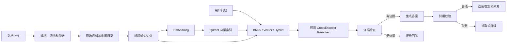

# Firmware Knowledge Agent 学习顺序

这份文档用于项目完成后的逆向学习。目标不是背完所有代码，而是能够：

1. 画出文档从上传到回答的完整链路。
2. 解释 BM25、向量检索、混合检索和 Reranker 的区别。
3. 说明 LangGraph 为什么会回答、拒答或降级。
4. 看懂 Hit@K、MRR 和拒答准确率。
5. 独立完成一个小修改并运行测试。

## 总链路



需要先分清两层存储：

- `var/private-corpus/` 保存清洗后的原始文本和 `sources.json`，用于重新
  切分、更新和审计。
- `var/vector-store/` 保存 Qdrant 向量索引，用于语义检索。

向量数据库不能代替原始语料。切分参数、Embedding 模型或文档内容变化
后，系统需要从原始语料重新建立索引。

## 第一阶段：先会使用

当前本机演示入口：

```text
http://127.0.0.1:8011/
```

优先操作四个接口：

1. `GET /health`：查看文档数、Chunk 数、检索器和向量库状态。
2. `POST /v1/search`：只观察检索结果，不生成答案。
3. `POST /v1/answer`：查看抽取式基线和引用。
4. `POST /v1/agent/answer`：观察 LangGraph Trace、生成、拒答和降级。

验收：

- 能说出 `search`、`answer`、`agent/answer` 的区别。
- 能用一个库内问题得到带来源回答。
- 能用一个库外问题触发 `no_evidence`。
- 能在 `/health` 中确认当前使用 Qdrant。

## 第二阶段：理解数据协议和 API

阅读：

- `src/firmware_knowledge_agent/models.py`
- `src/firmware_knowledge_agent/api.py`
- `tests/test_api.py`

重点：

- `SourceSpec` 描述一篇来源文档，`KnowledgeChunk` 描述切分后的片段。
- `SearchHit` 为什么同时包含分数、排名和 Chunk。
- `Citation` 为什么保留标题、章节、Chunk ID 和来源地址。
- FastAPI 为什么只做参数校验和异常转换，核心逻辑放在 Service。
- 上传文档后为什么需要调用 `service.reload()` 重建当前检索器。

练习：给查询接口增加一个可选的 `top_k` 上限校验，并运行 API 测试。

## 第三阶段：理解文档入库和切分

阅读：

- `src/firmware_knowledge_agent/local_ingestion.py`
- `src/firmware_knowledge_agent/corpus.py`
- `tests/test_local_ingestion.py`
- `tests/test_corpus.py`

链路：

```text
上传文件
-> 按格式解析
-> 清洗和敏感字段脱敏
-> 写入 private-corpus
-> 更新 sources.json
-> 按标题和长度切分
-> 生成 KnowledgeChunk
```

重点：

- Markdown、TXT、HTML、PDF、DOCX 分别如何转成统一文本。
- 为什么先按标题保留语义边界，再做长度二次切分。
- `chunk_size` 和 `chunk_overlap` 分别解决什么问题。
- 来源元数据为什么必须在每个 Chunk 中保留。
- 私有文档为什么位于 Git 忽略目录，但仍能被 RAG 服务读取。

练习：导入一篇自己编写的无敏感 Markdown 文档，确认文档数和 Chunk 数
发生变化，并检查标题和来源是否保留。

## 第四阶段：理解 Embedding 和 Qdrant

阅读：

- `src/firmware_knowledge_agent/embeddings.py`
- `src/firmware_knowledge_agent/vector_store.py`
- `tests/test_embeddings.py`
- `tests/test_qdrant_vector_store.py`

重点：

- Embedding 是把文本映射为向量，不负责直接生成答案。
- 当前本地模型是 `qwen3-embedding:0.6b`，Qdrant 保存 Chunk 向量和
  Payload。
- 余弦相似度分数和 `vector_min_score` 如何决定是否有足够证据。
- Embedding 缓存为什么能避免重复计算。
- 文档、切分参数或模型发生变化时，索引指纹为什么会触发重建。

练习：在测试语料上修改一个 Chunk，观察索引清单变化，但不要直接修改
私有业务语料来制造评测提升。

## 第五阶段：理解检索与重排

阅读：

- `src/firmware_knowledge_agent/retrieval.py`
- `src/firmware_knowledge_agent/reranking.py`
- `src/firmware_knowledge_agent/service.py`
- `tests/test_retrieval.py`
- `tests/test_reranking.py`

四条链路：

```text
BM25：关键词匹配
Vector：语义相似度
Hybrid：BM25 + Vector，再通过 RRF 融合排名
Reranker：对第一阶段候选重新计算 query-document 相关性
```

重点：

- BM25 为什么适合精确术语，但容易受同义表达和中英文差异影响。
- Vector 为什么能召回语义相近内容，但需要相似度门槛控制误召回。
- RRF 融合的是排名，不是直接相加两种检索分数。
- Reranker 只重排候选，无法找回第一阶段完全没有召回的文档。
- 技术组件更多不代表效果更好，必须根据评测结果选择默认链路。

当前私有语料回归集中，纯 Vector 的 MRR 高于 Hybrid；Reranker 改善了
Hybrid，但仍未超过纯 Vector，因此默认使用 Vector，其他链路保留用于
对照。

练习：选一个问题分别使用 BM25、Vector 和 Hybrid，记录 Top-3 的来源、
排名和分数，解释差异。

## 第六阶段：理解 LangGraph 回答链路

阅读：

- `src/firmware_knowledge_agent/agentic_workflow.py`
- `tests/test_agentic_workflow.py`

工作流：

```text
START
-> retrieve
-> grade_evidence
-> generate
-> verify_answer
-> complete / fallback
-> END

无证据时：
grade_evidence -> refuse -> END
```

重点：

- `AgenticRagState` 保存问题、检索结果、答案、引用和 Trace。
- `grade_evidence` 为什么在调用模型前决定是否拒答。
- `generate` 为什么只允许模型根据已检索证据回答。
- `verify_answer` 如何检查回答中的引用编号。
- 模型超时、空回答或非法引用时为什么降级为抽取式答案。
- 这是一条带条件路由的 Agentic RAG 工作流，不需要为了名称拆成多个
  Agent。

练习：让测试生成器返回一个越界引用，确认流程进入 `fallback`；再用
库外问题确认不会调用生成器。

## 第七阶段：理解评测

阅读：

- `src/firmware_knowledge_agent/evaluation.py`
- `evals/README.md`
- `var/private-corpus/holdout-v2.json`
- `tests/test_evaluation.py`
- `tests/test_evaluation_evidence.py`

指标：

- `Hit@3`：正确证据是否进入前三条。
- `MRR`：第一条正确证据排名的倒数均值，越靠前越好。
- `abstention_accuracy`：无答案问题是否正确拒答。
- `overall_accuracy`：可回答命中和无答案拒答共同统计。

当前简历使用参数冻结后的 40 题私有留出集：

- 30 条可回答题，`Hit@3=0.9667`、`MRR=0.8556`。
- 10 条域外题，拒答准确率 `1.0000`。
- 总体检索/拒答准确率 `0.9750`。
- 抽取式端到端答案基线通过率 `0.9250`，来源命中率和引用合法率均为
  `1.0000`。
- 失败样例和原始报告保留，不再针对这份留出集调参。

注意：

- 36 题同源回归集用于开发回归，不等于未知问题泛化能力。
- 不能把总体准确率 `0.95` 简写成“RAG 准确率 95%”。
- `answer_evaluation.py` 进一步检查答案关键词、来源命中、引用合法性、拒答、
  降级率和延迟；它仍不等价于人工事实一致性审核。

练习：新增题目时先冻结预期来源和证据词，再运行检索；不能看到结果后
修改标签来迁就当前输出。

## 第八阶段：理解工程入口

阅读：

- `src/firmware_knowledge_agent/service.py`
- `src/firmware_knowledge_agent/api.py`
- `src/firmware_knowledge_agent/cli.py`
- `README.md`

重点：

- 环境变量如何选择语料目录、Embedding、检索器、Reranker 和生成器。
- API、CLI 和评测程序为什么复用同一套 Service 与 Retriever。
- 为什么私有原文和向量索引都不提交到代码仓库。
- 服务启动时如何加载语料，关闭时如何释放 Qdrant 资源。
- 为什么嵌入式 Qdrant 当前只能单进程持有目录锁。

## 第九阶段：理解双项目联动和部署

阅读：

- `../device-agent-lab/src/device_agent_lab/knowledge_gateway.py`
- `../device-agent-lab/deploy/compose.yaml`
- `../device-agent-lab/docs/MACOS_ORBSTACK_DEPLOYMENT.md`
- 本项目 `Dockerfile`

重点：

- RAG 是独立 FastAPI 服务，DeviceOps 通过 HTTP 调用，不把两个代码库揉成一个。
- 私有语料以本机 volume 挂载，不写入镜像。
- 两个容器通过 `host.docker.internal` 复用宿主机 Ollama。
- RAG 失败时 DeviceOps 仍保留真实设备证据并显式降级。
- 两个项目可以分别写进简历，但演示时组成
  `DeviceOps -> RAG -> Ollama -> XDP MCP -> 真实设备`。

## 最终验收

完成以下任务后，才能把项目视为“本人可以面试”的项目：

1. 不看代码画出上传、索引、检索、生成、引用和拒答的完整链路。
2. 解释原始语料目录与 Qdrant 向量数据库的区别。
3. 解释 BM25、Vector、Hybrid 和 Reranker 的适用范围。
4. 解释 LangGraph 每个节点以及两条条件分支。
5. 解释 Hit@3、MRR、拒答准确率和留出集。
6. 独立增加一种元数据字段或一个小型校验，并补测试。
7. 能从一个失败问题定位到解析、切分、Embedding、召回、重排、生成、
   引用或证据门槛中的具体环节。
8. 解释为什么两个项目独立，又如何通过 HTTP 和 Docker Compose 串联。
